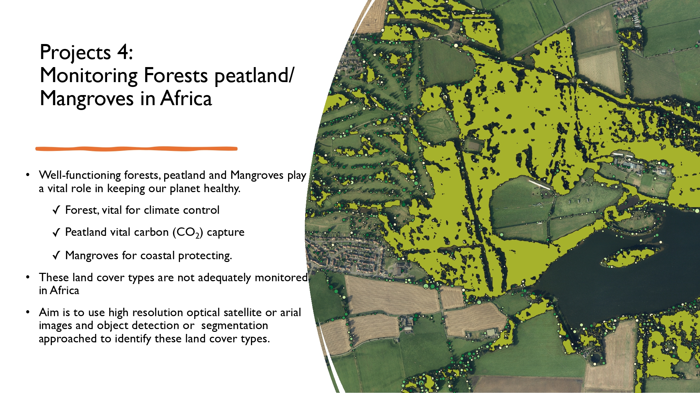
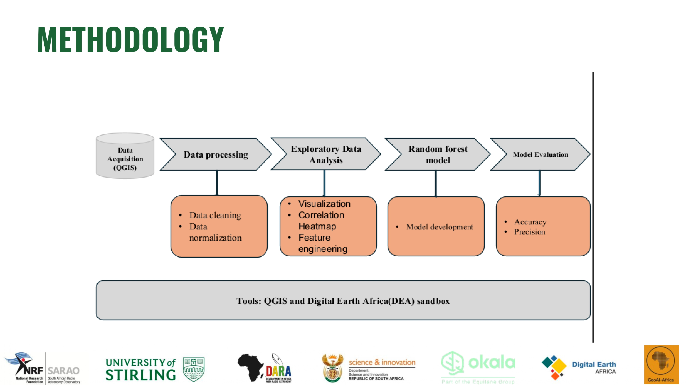
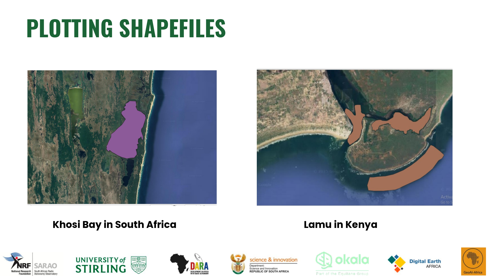
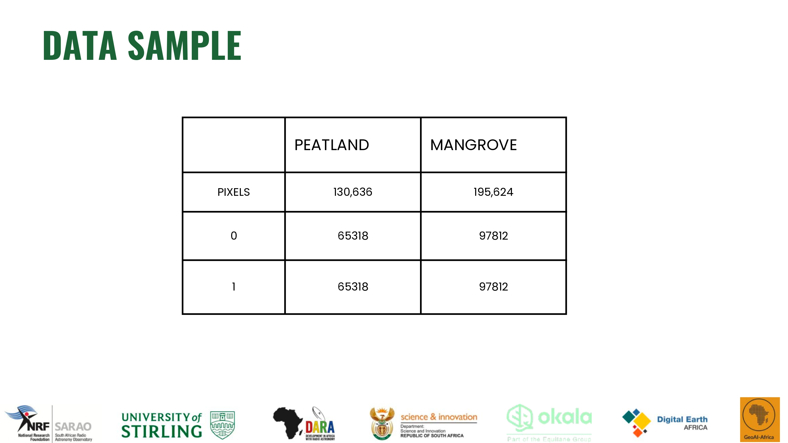
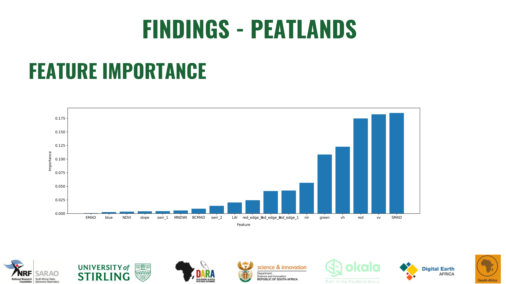
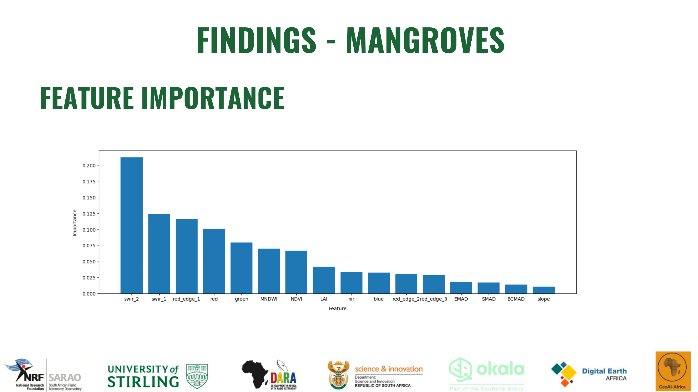
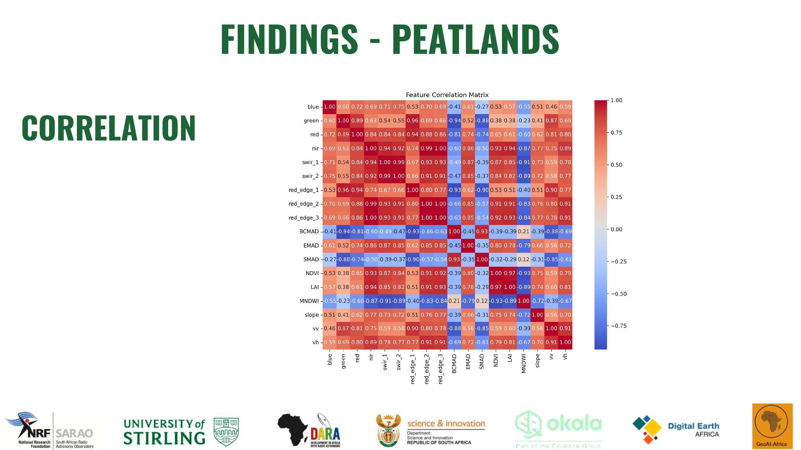
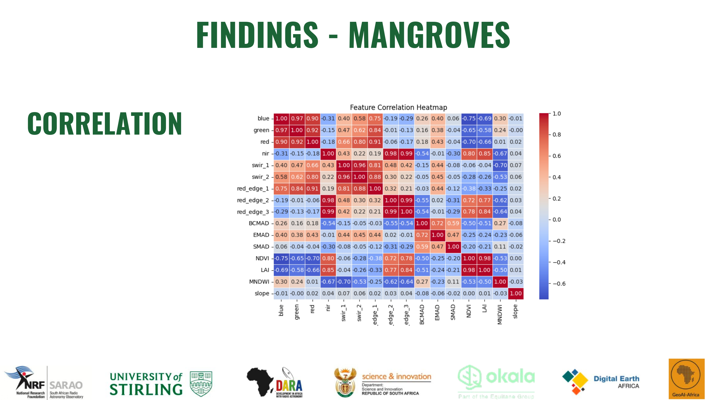
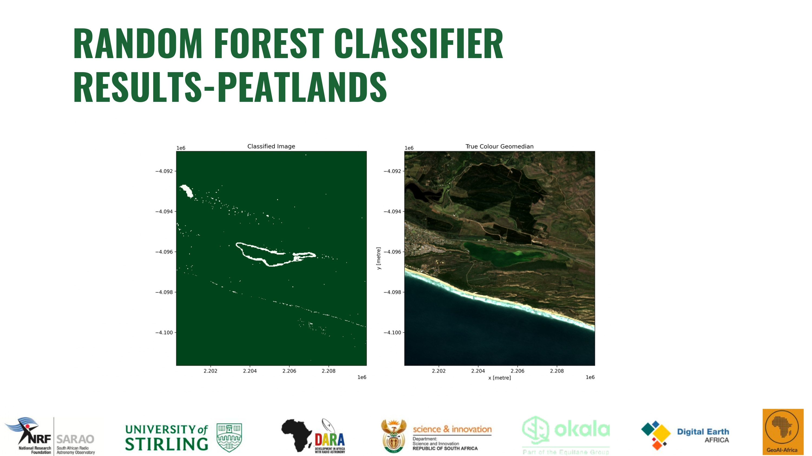
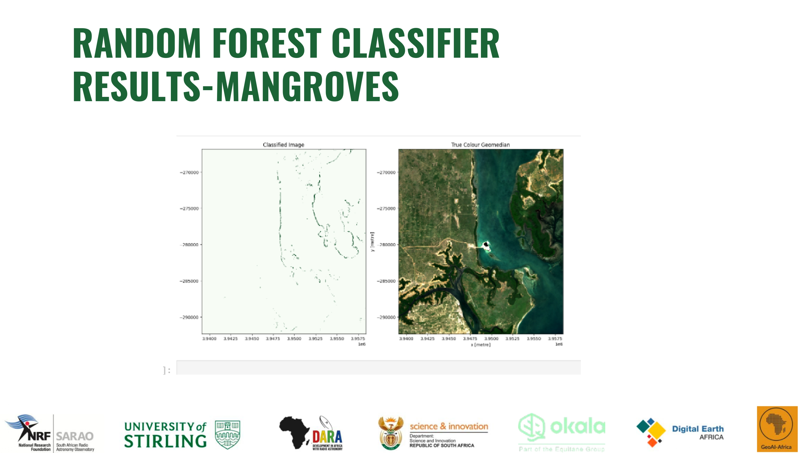

# Monitoring Forests, Peatlands, and Mangroves in Africa

This project focuses on monitoring and mapping **forests, peatlands, and mangroves** across Africa using remote sensing data and machine learning methods. These ecosystems are critical for climate regulation, carbon capture, and coastal protection, yet they remain under-monitored on the continent.
---

## ℹ️ About the Project


This project is part of research initiatives by **NRF & SARAO**, focusing on:
- Tracking changes in mangroves and peatlands over time  
- Identifying unmonitored areas for conservation  
- Supporting environmental research and global CO₂ reduction efforts  
---

## 🌍 Project Objectives
- Monitor the **evolution of peatlands and mangroves** over time.  
- Develop **machine learning models** (e.g., Random Forest, SVM) for mapping and classification.  
- Generate a **map inventory** of mangrove forests and peatlands.  
- Support **real-time monitoring solutions** for conservation efforts.  

---

## 🛠️ Methodology
- Use **satellite imagery** (Landsat, Sentinel-2, GeoMAD).  
- Apply **Random Forest classifiers** for peatland and mangrove detection.  
- Perform **feature importance analysis** and correlation studies.  
- Improve models by incorporating data from more African countries.  

---

## 📂 Project Structure
```
monitoring-forests-peatlands-mangroves-africa/
│
├── assets/                 
├── data/
├── notebooks/
├── scripts/
├── results/
├── docs/
├── requirements.txt
├── README.md
```

---

## 📊 Sample Results



















---

## 🚀 Future Work
- Expand dataset coverage across more African countries  
- Collaborate with conservation agencies for validation  
- Explore **deep learning approaches** for improved classification  
- Integrate with **real-time monitoring systems**

---

## 📚 Resources & References

- [Landsat Surface Reflectance](https://github.com/digitalearthafrica/deafrica-sandbox-notebooks/blob/main/Datasets/Landsat_Surface_Reflectance.ipynb)  
- [Sentinel-2](https://github.com/digitalearthafrica/deafrica-sandbox-notebooks/blob/main/Datasets/Sentinel_2.ipynb)  
- [GeoMAD](https://github.com/digitalearthafrica/deafrica-sandbox-notebooks/blob/main/Datasets/GeoMAD.ipynb)  
- [Digital Earth Africa Documentation](https://docs.digitalearthafrica.org/en/latest/data_specs/index.html)  
- [Scalable Machine Learning Examples](https://github.com/digitalearthafrica/deafrica-sandbox-notebooks/tree/main/Real_world_examples/Scalable_machine_learning)  

---

## 👩‍💻 Team Members
- **Fanelesibonge Mbuyazi**  
- Quinta Otieno  
- Felicity Musau  
- Pfano Nemakonde  
- Alhamdulilah Adiza  

---

## 🙏 Special Thanks
We acknowledge the support and resources provided by:  
- **National Research Foundation (NRF)**  
- **South African Radio Astronomy Observatory (SARAO)**  
- **University of Stirling**  
- **DARA (Development in Africa with Radio Astronomy)**  
- **Department of Science and Innovation (DSI)**  
- **Okala**  
- **Digital Earth Africa**  
- **GeoAI Africa**  
